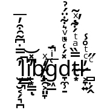

# libgdtl

BiDi, shaping and basic text layout for Godot Engine.

(Test version for the Godot 4.0 branch, module only.)

## Dependencies

- Godot 4.0
- C++14 compiler
- SCons build system

## Compiling (as builtin module)

### Build options

Name | Description | Default value
--- | --- | ---
`builtin_runtime` | Use the built-in libraries | `true`
`use_graphite2` | Enable SIL Graphite 2 complementary shaper | `true`
`use_font_wrapper` | Enable Godot font wrapper for default controls | `false`

If `use_font_wrapper` is enabled, apply `patch_font.diff` from the root of this repository to the Godot engine source first. Additionally apply `patch_editor_fonts.diff` to use `libgdtl` to render editor fonts and `patch_lbl.diff`/`patch_le.diff` to override default `Label` and `LineEdit` with TL counterparts.

### Building `libgdtl` module

Clone this repository (without `--recursive` flag) into Godot's `modules` subfolder as `godot_tl`.
Rebuild Godot engine as usual.

## Documentation

[Documentation](https://bruvzg.github.io/godot_tl/docs/html/index.html)

[Class reference](https://bruvzg.github.io/godot_tl/docs/html/classes/index.html)

## License
- The source code of the **libgdtl** module is released under unlicense.
For more information, see http://unlicense.org/ or the accompanying UNLICENSE file.

- **HarfBuzz** is licensed under MIT-like License.
For more information, see https://github.com/harfbuzz/harfbuzz/blob/master/COPYING

- **ICU4C** is licensed under Unicode, Inc. License.
For more information, see http://www.unicode.org/copyright.html#License

- **FreeType** is licensed under FreeType License (BSD-like) or GNU General Public License (GPL), version 2.
For more information, see https://www.freetype.org/license.html

- **SIL Graphite engine** is licensed under GNU Lesser General Public License (LGPL), version 2.1+ or GNU General Public License (GPL), version 2 or Mozilla Public License.
For more information, see https://github.com/silnrsi/graphite/blob/master/COPYING

## Demo data

[Montserrat](https://github.com/JulietaUla/Montserrat/), [Awami Nastaliq](https://software.sil.org/awami/download/), [Comic Neue](http://comicneue.com/) and [Noto](https://www.google.com/get/noto/) fonts are published under the [SIL Open Font License, Version 1.1](https://scripts.sil.org/cms/scripts/page.php?site_id=nrsi&id=OFL)

[Material Design icons by Google](https://github.com/google/material-design-icons) are published under the [Apache License Version 2.0](https://www.apache.org/licenses/LICENSE-2.0.txt)

Noto Color Emoji font is cut down to single glyph (U+1F604) using [glyphhanger](https://github.com/filamentgroup/glyphhanger).

