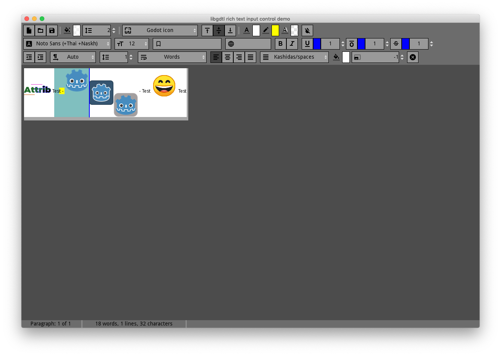
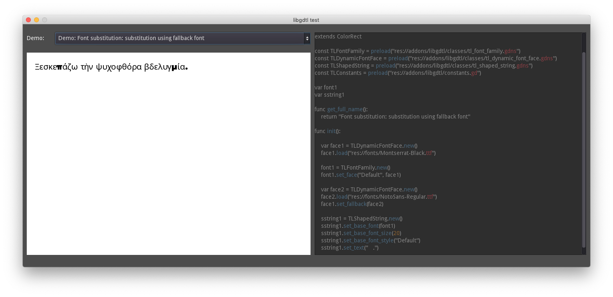

# Demos

### Important note

For gdnative demos copy `libgdtl` (with compiled libraries) into `addons` subfolder of each demo.

## `input_builtin` and `input_gdnative`

Rich text input control demo: input, cursor and selection, opening and saving `*.gdrtf` files.

## `disp_builtin` and `disp_gdnative`

Shapaed string demo: fonts, string construction, rendering, line breaking and justification.
