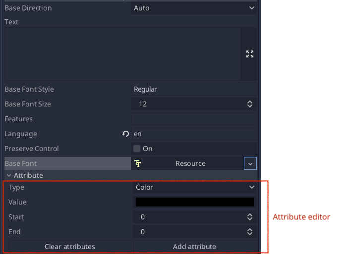

.. _doc_rich_text_typesetting:

Rich text typesetting
=====================

Setting formatting for the range of text
----------------------------------------

1. Select desired attribute and its value in the attribute editor.
2. Enter start and end offsets of the range.
3. Click "Add" button to apply formatting.

Node: This is equivalent of the `add_attribute` function call.

Removing formatting
-------------------

1. Enter start and end offsets of the range in the attribute editor.
2. Click "Remove" button to clean all attributes from the range or click "Clean" to remove attributes from entire text.

Node: This is equivalent of the `remove_attributes`/`clear_attributes` function call.

Embedding child control into the text flow
------------------------------------------

1. Add control as child of the TLRichTextEdit.
2. Apply "Replacement Rect" attribute with desired size of the control to the single character of the text.
3. Apply "Replacement ID" attribute with the control name to the same character.
4. Use "Replacement VAlign" attribute to set inline alignment of the control.

